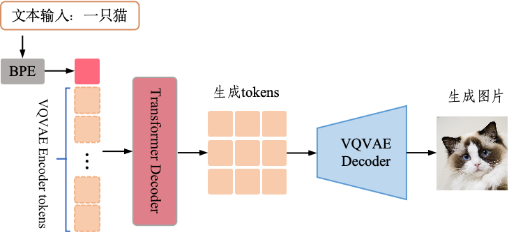
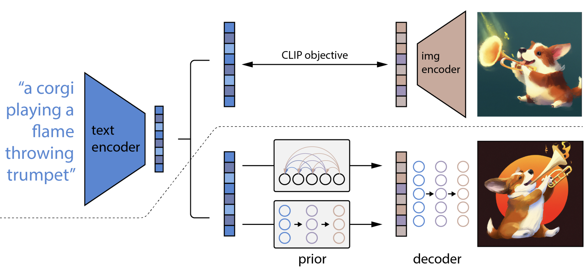
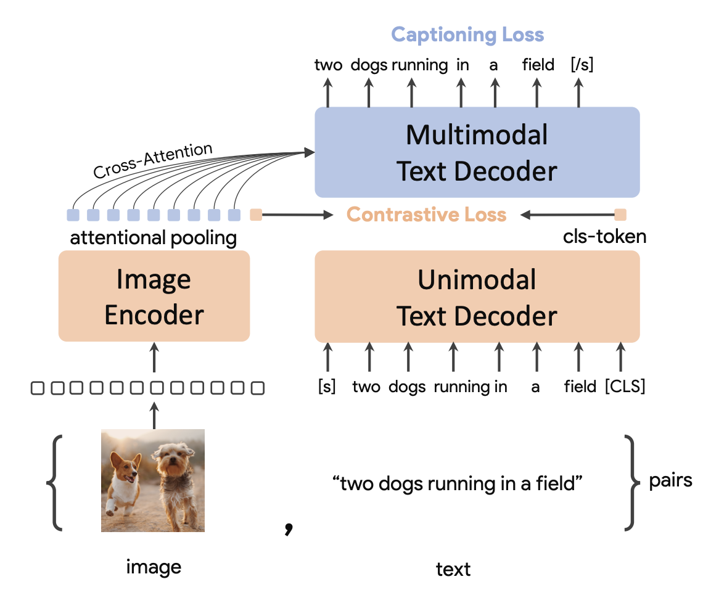
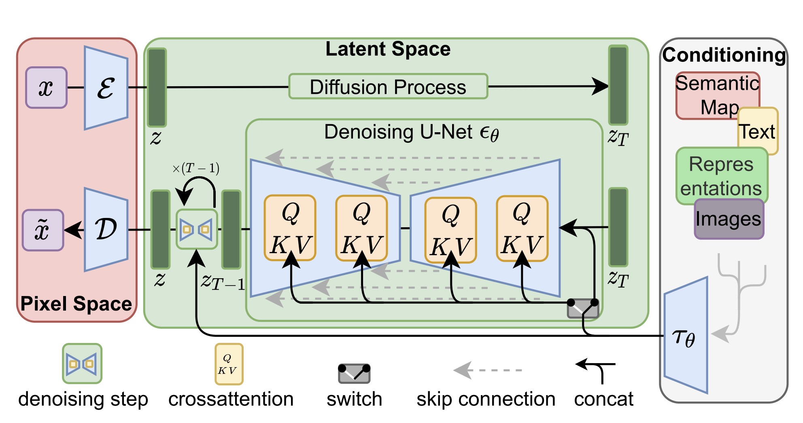
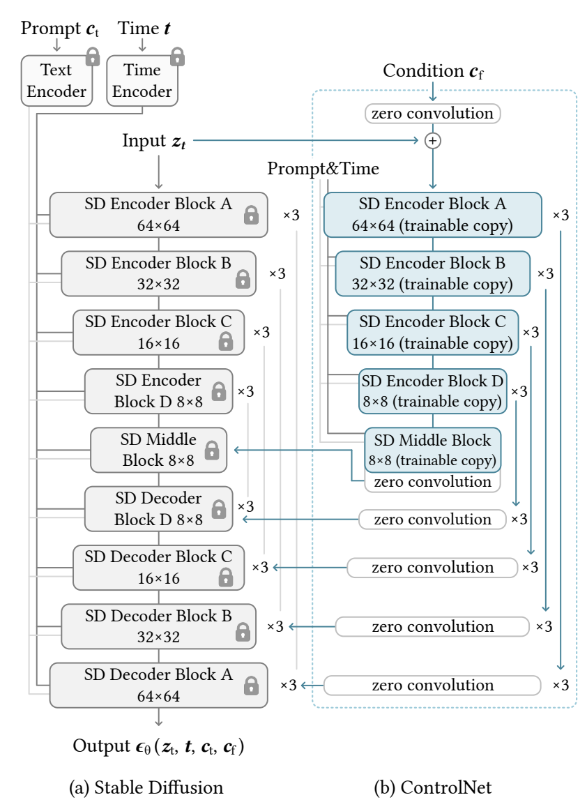
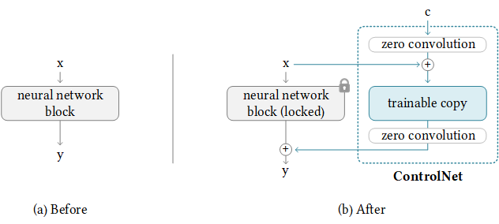
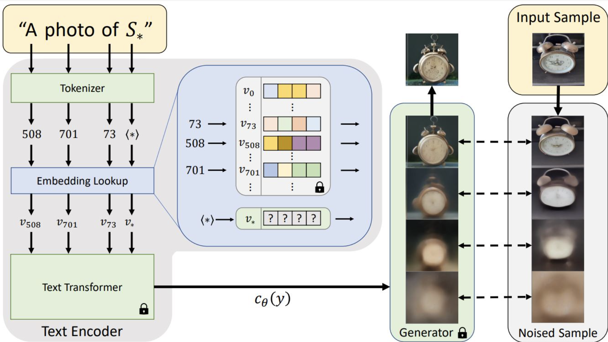
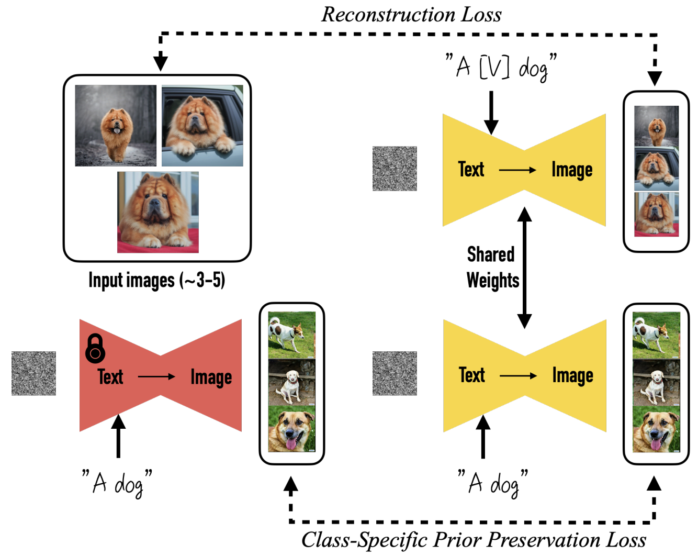
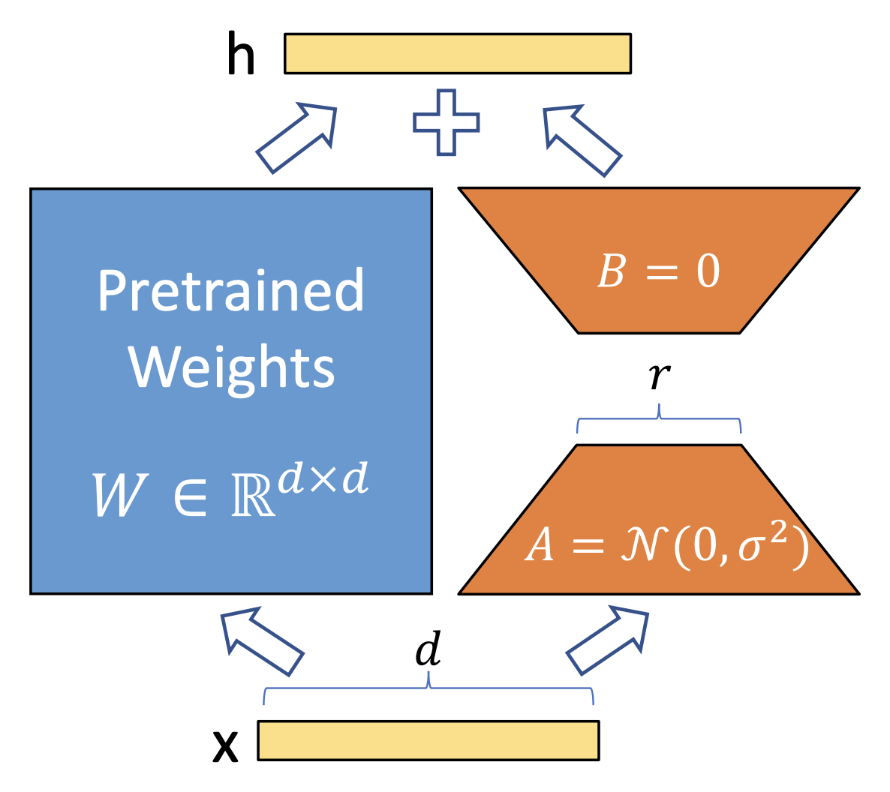
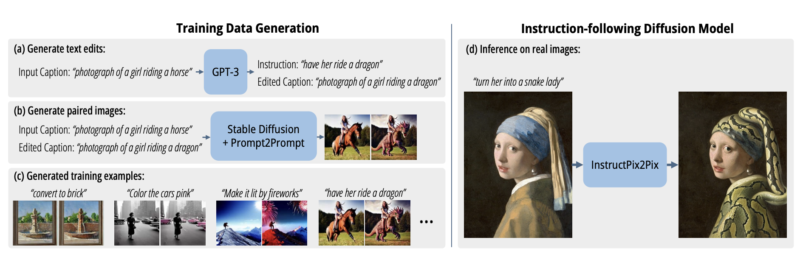

# 第五章 图片生成与编辑

> 形而上者谓之道，形而下者谓之器。-- 《周易·系辞》

&emsp;&emsp;在数字化浪潮的推动下，图像生成与编辑技术正以前所未有的速度重塑人类的视觉表达与创作方式。从社交媒体中的滤镜特效到电影工业的虚拟场景构建，从艺术创作的AI辅助到医学影像的智能增强，这些技术不仅拓展了创意的边界，更深刻影响了信息传播、文化生产乃至科学研究的范式。近年来，深度学习与生成模型的突破性进展，使得计算机能够从零开始生成高度逼真的图像，甚至实现像素级的精准编辑。这一领域的进步，既是对传统图形学工具的革命性颠覆，也为跨学科应用开辟了全新的可能性。本章将聚焦于技术实现的关键环节：如何通过文本、草图或多模态输入控制生成内容？如何在高分辨率图像中保持细节一致性？如何在编辑过程中实现语义感知与局部微调？这些问题将在本章中展开探讨。

## 5.1 模型结构

目前主流的文生图的方法主要是基于VAE方法例如DALL-E系列，或者基于Diffusion方法比如DALL-E系列、Stable-Diffusion系列。本章会结合第一章的理论部分对这些主流架构做详细介绍。

### 5.1.1 DALL-E系列

DALL-E系列是OpenAI推出的文生图片模型，其中DALL-E-1是两阶段的生成模型。首先，用VQVAE的结构压缩图片的高维空间，通过将256×256的RGB图像压缩为32×32的离散图像标记（8192种可能的词元），显著降低了后续建模的计算复杂度。然后，利用BPE编码的文本标记（最多256个）与图像标记（1024个）拼接为单一输入流，通过自回归Transformer联合建模文本和图像的分布。VQVAE的训练过程与第一章中介绍的一致，第二部分的训练过程如图5.1所示。

图5.1 DALL-E-1的文生图过程

DALL-E中的生成模型是一个参数量达12B的Decoder only的自回归模型。在第一阶段训练完VQVAE之后，固定其参数，作为图片tokenizer，用于将图片token化，使用NLP中常用的BPE对文本做token化。之后，将文本token和图片token拼接起来，得到token序列。以文本token为prefix，把当前位置后面的图片token都mask掉，自回归地预测下一个图片token，实际就是预测下一个token在codebook中的索引，通过交叉熵损失函数优化。

DALL-E-1有两个明显的缺点：

- 直接将文本通过BPE编码会使得文本的token与图片的token之间会出现明显的domain gap，从而使得文本和图片对齐性不好，可控性效果差。
- 图片通常是高维离散的，尽管用VQVAE编码后特征得到了一定程度的压缩，但是表征还是相对离散的。Transformer比较适合建模具有连续语义特征的序列任务，在图片生成中会相对劣势。

DALL-E-2从以上两个方面对DALL-E-1进行了优化。如图5.2所示，在虚线上方是CLIP训练过程，通过该过程，我们可以学习文本和图像的联合表征空间。虚线下方是DALL-E-2的文本到图像的生成过程：首先将CLIP的文本表征送到自回归或扩散先验中以生成图像表征，然后使用此表征来调节和控制扩散解码器，从而生成最终文本描述的图像。这过程中需要训练的是文本到图片表征转换的先验以及解码器，CLIP模型始终处于冻结状态。

图5.2 DALL-E-2的文生图过程

CLIP模型是OpenAI提出的基于海量图片文本对数据集进行对比学习预训练的图文跨模态特征对齐方法，CLIP由图片编码器和文本编码器组成，它们各自对图片和文本数据进行编码，两种数据模态的特征可以直接相似度和损失函数。但是DALL-E-2并没有直接用CLIP的文本Encoder编码的文本特征作为条件控制图片生成，因为这样的图片特征与文本特征还是存在较大的跨模态的gap。因此，需要将文本表征转换到对应的图片表征以控制Diffusion Decoder的生成。

OpenAI发现现有的文本到图像模型在处理详细的图像描述时常常遇到困难，经常忽略或混淆提示的含义。OpenAI认为这个问题源于训练数据集中图像描述的噪声和不准确性。在大规模数据集中，人类通常只关注图像主题的简单描述，忽略了背景细节或图像中描绘的常识关系。常被忽略的重要细节可能包括：物体的存在，如厨房的水槽或人行道上的停车标志；物体在场景中的位置和数量；场景中物体的颜色和大小等常识细节；图像中显示的文本。为了进一步提升文本与图像的对齐程度，OpenAI训练了一个专门的图像描述生成器，并用它重新生成训练数据集的描述。这里选用的模型架构是谷歌的[CoCa](https://arxiv.org/abs/2205.01917)，如图5.3所示，CoCa相比CLIP额外增加了一个Multimodel Text Encoder来生成caption，它训练的损失也包含CLIP的对比损失和captioing的交叉熵损失。所以CoCa不仅可以像CLIP那样进行多模态检索，也可以用于caption生成。

图5.3 CoCa的结构及训练过程

由于原先数据集中的caption是短的且质量差，为了提升模型生成文本描述（caption）的质量，利用训练好的image captioner对数据集中所有图片重新描述，形成新的描述图像内容的长caption，用这样的数据集训练模型，可以使得文本生成更符合文本描述，对齐度高。

### 5.1.2 Stable-Diffusion系列

Stable Diffusion系列是由[Stability](https://stability.ai/)、[Runway](https://runwayml.com/)、[CompVis](https://github.com/CompVis)等公司和机构推动的开源文生图模型。Stable Diffusion v1 使用下采样因子为 8 的自编码器 (autoencoder)、一个 8.6 亿参数的 UNet 以及 CLIP ViT-L/14 文本编码器作为扩散模型。该模型在 256x256 图像上进行了预训练，然后在 512x512 图像上进行了微调，主要的结构如图5.4所示。

图5.3 Stable-Diffusion v1的模型结构

第一部分是AutoEncoder（图中红色部分），由Encoder和Decoder组成，可以理解为将人类能感知的图像空间(pixel space)映射到模型能感知的隐空间(latent space)。其中，Encoder将像素空间中的$x$映射到隐空间中的$z$，Decoder则是将去噪后的隐变量$z$从隐空间映射回像素空间得到$\tilde{x}$。

第二部分是Generation Model（图中绿色部分），主要用的是扩散模型。其中每一步的去噪过程都使用的Unet结构来预测噪声，$z$经过前向加噪扩散过程之后得到加噪后的隐变量$z_T$，然后继续经过数步去噪之后得到去噪后的隐变量$z$。在v1中这部分用的是DDIM的方法。

第三部分是Condition Model（图中灰色部分），主要是用文本、图片等条件控制第二部分是Generation Model中噪声的预测，从而达到控制图片生成的目的。在v1中这部分用的是预训练好的CLIP模型。

后续的Stable-Diffuison v2都是大致遵循同样的结构，但是会在结构的细节参数上有所不同。例如，它使用下采样因子为 8 的自动编码器，以及一个 865M UNet 和 OpenCLIP ViT-H/14 文本编码器用于扩散模型，模型产生 768x768 像素的输出。

### 5.1.3 ControlNet系列

前面我们提到的模型，都是通过文本控制来生成图片，但是语言描述的文本通常具有多义性，很难准确描述出一张图片的构成表示。因此，为了实现更精确的控制生成，ControlNet系列应运而生，它通过在原始Stable Diffusion模型旁增设可训练分支并锁定原有权重，使得用户可以输入边缘图、深度图、姿态图等额外条件来精细控制生成过程。它利用已有的强大预训练模型作为骨干，在保持原始生成能力的同时，通过注入“视觉提示”来增强图像合成的可控性和灵活性。

图5.4 ControlNet框架结构

如图5.4所示，在Stable Diffusion这样的文本到图像扩散模型中，ControlNet被嵌入于U-Net网络的各个编码层级，具体而言，Stable Diffusion的12个编码块（4种分辨率，每级重复3次）以及1个中间块都对应一个ControlNet可训练分支，其输出通过跳跃连接加到原模型的相应层上，这一简单结构在Stable Diffusion的整个U-Net中被重复应用14次，以对生成过程进行全面控制。由于锁定了原始网络的权重，仅对控制分支进行微调，ControlNet可以快速收敛并保持原模型的生成能力不变。

ControlNet可以接收多种额外的图像条件作为引导输入，如Canny边缘图、深度图、人体姿态骨架图、分割图等，这些条件图像通常由专用的预处理网络（如HED边缘检测、MiDaS深度估计、OpenPose姿势检测等）生成，用于提取目标对象的结构信息。如何将这些条件注入模型呢？在每个U-Net块的ControlNet分支中，采用“双零卷积”结构将条件信息整合到网络：首先通过一个1×1的零初始化卷积层将条件特征映射并加到主干输入上，然后将其送入可训练副本块计算；最后再经过第二个1×1零卷积后与原始块的输出相加。由于这两个卷积层的权重初始为零，训练初期它们的输出都是零，因此ControlNet在开始训练时并不会对原始网络输出造成任何干扰。

图5.4 ControlNet条件注入

## 5.2 模型微调

本文主要介绍文生图模型的微调，它是迁移学习中的关键技术之一，指在预训练模型（如Stable Diffusion等）的基础上，通过少量新数据调整模型参数，使其适应特定任务或领域，达到四两拨千金的效果。相比从头训练，微调能大幅降低计算成本、数据需求和训练时间，同时保留模型的通用能力。

### 5.2.1 Textual-Inversion

文生图模型在生成个性化物体或风格的图片时仍存在挑战。Textual-Inversion提出了一种简洁高效的方法，仅需用户提供的3-5张概念图像（如物体或风格），即可在冻结的预训练文本到图像模型的参数时，通过优化文本嵌入空间（word embeddings）中的“伪词”（pseudo-word）实现个性化文本到图像生成，并支持灵活的语言引导生成。实际上，就是让预模型根据本身已有的经验去学习一个概念，理解（学习）这个概念之后，概念变成了机器可以理解的嵌入向量（Embedding vector）用于后续生成，过程如图5.4所示。

图5.4 Textual_Inversion方法

这种理解的过程就是模型优化**文本嵌入空间中的伪词向量**的过程，使得冻结的预训练文本到图像模型（如 LDM）能够生成与用户提供的少量图像（3-5张）高度匹配的个性化内容，优化目标定义为：

$$
v_* = \arg\min_{v} \mathbb{E}_{z \sim \mathcal{E}(x), y, \epsilon \sim \mathcal{N}(0,1), t} \left[ \| \epsilon - \epsilon_{\theta}(z_t, t, c_{\theta}(y)) \|_2^2 \right]
$$

其中，$v_*$ 表示待优化的伪词嵌入向量（如 `S∗`），$z = \mathcal{E}(x)$表示用户图像通过编码器映射到潜在空间的特征，$y$ 表示基于模板生成的文本提示（如 “A photo of `S∗`”，$\epsilon_{\theta}$ 表示扩散模型的噪声预测网络，$c_{\theta}(y)$ 表示文本编码器生成的文本条件向量。通过优化嵌入向量 $v_*$ 时，固定文本编码器和扩散模型参数，仅调整 $v_*$，使其引导生成过程匹配用户图像。使用中性模板（如 “A photo of \(S_*”）生成多样化的文本提示，确保伪词嵌入能够泛化到不同上下文场景。

### 5.2.2 Dreambooth

DreamBooth 是一种基于文本到图像生成模型（如 Stable Diffusion）的**个性化微调技术**，允许用户通过少量图像（通常3-5张）和特定文本标识符，将自定义知识或图片（如人物、宠物或物体）嵌入模型中，从而让模型能生成该主题的多样化图像。其与Textual-Inversion想做的事情一致，区别在于Textual-Inversion不会更新模型参数，而 DreamBooth 是需要全量微调模型参数。

具体而言，如图5.5所示，主要分为两个部分。其一是**标识符绑定与微调**（图中上面部分），通过少量（3-5张）用户提供的主题图像，在预训练的文本到图像扩散模型中绑定一个**唯一标识符**（如[V]）与目标主题（如宠物狗）。训练时，每张输入图像被标记为“A [标识符] [类名]”（如“A [V] dog”），通过微调模型参数将标识符与主题的视觉特征关联。注意，[V]需使用罕见词作为标识符，避免与预训练词汇的语义冲突，确保模型能专注于学习新主题。其二是**保留先验与防过拟合**（图中下面部分），在微调过程中，同时生成同类别的通用图像（如随机生成的“a dog”图像），用于让模型保留类别的原始知识，同时防止过拟合。

图5.5 dreambooth方法介绍

因此，总损失函数由两部分组成。重建损失（公式第一项）确保模型能准确重建输入图像，先验保留损失（公式第二项）约束模型在生成同类通用图像时保留原有知识，防止语言漂移（即类名被错误绑定到特定实例）。

$$
\mathcal{L} = \mathbb{E}\left[ \| \hat{\mathbf{x}}_{\theta}(\mathbf{z}_t, \mathbf{c}) - \mathbf{x} \|^2 \right] + \lambda \cdot \mathbb{E}\left[ \| \hat{\mathbf{x}}_{\theta}(\mathbf{z}_{t'}, \mathbf{c}_{\text{pr}}) - \mathbf{x}_{\text{pr}} \|^2 \right]
$$

其中，$\lambda$ 控制先验保留项的权重，通过调整可以平衡新主题学习与原有知识保留。$\mathbf{x}_{\text{pr}}$ 为模型生成的同类图像。损失函数 $\mathcal{L}$ 的优化目标是图5.5中黄色的全量参数 $\theta$ 。

虽然 DreamBooth 能实现令人惊艳的个性化效果，但其方法本身也存在一些局限和挑战。一般情况下进行一次 DreamBooth 微调最好有至少16GB甚至24GB以上的 GPU 显存，否则训练过程可能非常缓慢或无法完成。例如，在Stable Diffusion上微调常需要数十分钟到数小时的时间以及高端GPU支持。并且，DreamBooth 的结果通常是一个完整的模型检查点（checkpoint）。由于微调了模型的所有层参数（通常数亿参数规模），保存下来的定制模型文件往往和原始模型一样大，通常在2\~7GB左右。如果用户针对不同主题各自微调，一个人很快会积累大量体积庞大的模型文件，给存储和管理带来负担。

### 5.2.3 LoRA

正是因为像 DreamBooth 这样全模型微调的方法存在上述**高成本和操作复杂**的问题，研究者们开始探索更高效的模型个性化方案。LoRA（Low-Rank Adaptation技术由微软研究院的团队于 2021 年提出，初衷是为了在不重新训练整个大模型的情况下，让模型快速适应新任务。LoRA 最早应用于对数十亿参数的大型语言模型（LLM）进行高效微调——面对GPT-3这类超大模型，逐层微调不仅耗时且需要海量显存，因此LoRA旨在冻结预训练模型的大部分权重，仅调整很小一部分参数，从而大幅降低计算和存储开销。

图5.6 LoRA原理

如图5.6所示，假设某一层原始权重为矩阵 $W$，LoRA 会引入两个较小的矩阵 $A$ 和 $B$，使得权重在微调时的有效更新 $\Delta W \approx A \times B$。其中 $A$ 的维度为 (n, r)，$B$ 为 (r, m)（$n \times m$ 是 $W$ 的维度，$r$ 远小于 $n,m$），这样新增参数量仅为 $n*r + r*m$，远小于直接调整 $n*m$ 个参数的情况。例如，如果原模型中有一个 1000×2000 的权重矩阵，包含约200万参数，那么 LoRA 可以将其表示为 1000×2 和 2×2000 两个矩阵的乘积，总参数量只有 1000*2 + 2\*2000 = 6000，压缩比例达333倍。

LoRA 虽然源自对 Transformer 架构大模型的优化，但完全适用于扩散模型的微调。针对 Stable Diffusion 这类文图生成模型，LoRA 方法一般将低秩适配模块插入到模型中最关键的交叉注意力层上。扩散模型的交叉注意力模块（通常表现为 Q、K、V 三个矩阵，用于将文本嵌入与图像特征结合）直接控制着图像生成对文本的响应，是决定风格和主体的关键。实践表明，仅仅微调这些交叉注意力层，就足以让模型学会新的概念而不破坏原有能力。

LoRA 带来的直接优势包括：

* **显著降低计算和显存开销**：由于需要训练的参数量大幅减少（梯度只在新增的低秩参数上计算），LoRA 微调占用的显存和计算资源比 DreamBooth 要小得多。实践中，很多原本只能在高端 GPU 上运行的微调任务，现在使用 LoRA 技术后在普通游戏 GPU 上也能完成。LoRA 让扩散模型的个性化训练**门槛降低**了。
* **模型文件体积小**：LoRA 微调不会产出一个完整模型，而只是保存了那些低秩新增权重（通常以差量形式存储）。因此生成的 LoRA 权重文件往往只有**几MB到几十MB**大小。相较于 DreamBooth 每次微调动辄产生上GB的新模型，LoRA 权重“轻量”得多，便于分发和共享。
* **适配多个任务**：由于 LoRA 以模块形式存在，一个基础扩散模型可以加载**不同的 LoRA 模型权重**来实现对多种风格、人物的切换。用户可以根据需要训练和收集许多 LoRA 模块（每个文件很小），在推理时按需组合使用，从而令同一个基础模型具备**多角色多风格**的生成能力，而不必维护多份完整模型。这带来了极大的灵活性：例如先后训练多个角色的 LoRA，并在生成时一起加载，它们就能在同一幅图中出现。LoRA 还支持与其它扩展组件（如 ControlNet 等）配合，使一个模型同时应用多个定制效果。
* **微调速度快**：参数减少也意味着每步迭代的计算量降低，LoRA 往往可以比传统微调更快收敛。在实际应用中，使用 LoRA 微调 Stable Diffusion 往往比 DreamBooth 更加高效，调参也相对简单，因为我们重点调整的是模型中最相关的那部分参数（如注意力层），而不是整个模型。这种**定向微调**降低了过拟合其它无关部分的风险，在相同数据下可能比全模型微调得到更好的泛化效果

需要注意的是，LoRA 的高效是以有限的可调整容量为代价的。如果选择的秩太低，LoRA 的模型可能无法完美再现全量微调的效果，表现为生成质量略有下降或细节不够丰富。

## 5.3 图片编辑

除了直接生成图片以外，生成模型也可以对图片局部进行编辑。当前扩散模型的图片编辑大体分为两条路线。其一是“潜空间反演流”，先用 DDIM-Inversion 等算法将现有图像反推至高噪声潜变量，再沿扩散轨迹重采样，实现结构重排或大幅风格变换，保真度高，适合照片级再创作，但却需额外反演计算开销。其二是“指令驱动流”，生成大量成对的图片文本对进行模型训练，从而可以用一句自然语言指令对局部色彩或元素做语义级修改，交互便捷、推理开销小，但对 Token 对齐和场景复杂度较敏感。

### 5.3.1 潜空间反演

DDIM-Inversion（去噪扩散隐式模型反演）是扩散模型中一种重要的技术，其核心目标是将输入图像逆向映射到隐空间（latent space），以便进行图像重建、编辑或插值。其原理基于 DDIM 的非马尔可夫性和确定性生成过程。让我们先回忆以下第四章讲的DDIM的加噪过程：

$$
\begin{aligned}
\mathbf{x}_t &= \sqrt{\alpha_t}\mathbf{x}_{t-1} + \sqrt{1 - \alpha_t}\boldsymbol{\epsilon}_{t-1} \boldsymbol{\epsilon}_{t-2}, \dots \sim \mathcal{N}(\mathbf{0}, \mathbf{I}) \\
   &= \sqrt{\alpha_t \alpha_{t-1}} \mathbf{x}_{t-2} + \sqrt{1 - \alpha_t \alpha_{t-1}} \bar{\boldsymbol{\epsilon}}_{t-2} \\
&= \dots \\
&= \sqrt{\bar{\alpha}_t}\mathbf{x}_0 + \sqrt{1 - \bar{\alpha}_t}\boldsymbol{\epsilon} \\
\end{aligned}
$$

在逆向过程中，$\mathbf{x}_{t-1}$ 的计算公式为：

$$
\mathbf{x}_{t-1} = \sqrt{\alpha_{t-1}} \left( \frac{\mathbf{x_t} - \sqrt{1-\alpha_t} \epsilon_\theta(\mathbf{x_t}, t)}{\sqrt{\alpha_t}} \right) + \sqrt{1 - \alpha_{t-1}} \epsilon_\theta(\mathbf{x_t}, t)
$$

其中，$ \alpha_t $ 随 $ t $ 增大而递减，$ \epsilon$ 是噪声。当方差参数 $σ_t=0$ 时，随机噪声项被消除，整个过程完全由模型预测的噪声 $ϵ_θ$ 驱动，从而确保每一步的确定性。DDIM前向过程也是对图片进行加噪，区别在于DDIM前向加的噪声是高斯随机噪声，而这里加的噪声是模型预测的噪声。

在潜空间反演的基础上，P2P算法成功实现了基于文本词语的细粒度图片编辑。

TODO

### 5.3.2 指令驱动

潜空间反演的过程较为耗时，通常在2-5分钟左右，有没有一种更直接的编辑方式呢？**InstructPix2Pix** 是一个预训练的模型，能根据自然语言指令对图像进行编辑的扩散模型，无需反演或手工标注，支持直接输入“图+编辑指令”，输出目标图像，实现真实图片的快速可控编辑。那么要如何构建成对的编辑前后的“图+编辑指令”的数据集呢？

图5.8 编辑前后的“图+编辑指令”的数据集生成

如图5.8所示，首先，输入原始图像 caption（来自 LAION 数据集），使用 GPT-3生成编辑指令 + 新 caption；之后，使用上一小节潜空间反演方法例如（Prompt-to-Prompt + Stable Diffusion）生成“编辑前/后图像”对，保持尽可能高的一致性；最后，用 CLIP 过滤筛选出质量高的图片对，构建大规模语义对齐数据集。模型是条件扩散模型，输入包括原图 latent、编辑指令 embedding。模型推理时，输入任意一张真实图片与一条自然语言指令；模型执行一次前向采样即可生成目标图，用户可调节 sI（保持原图结构）与 sT（遵循指令程度）以获得理想结果。
