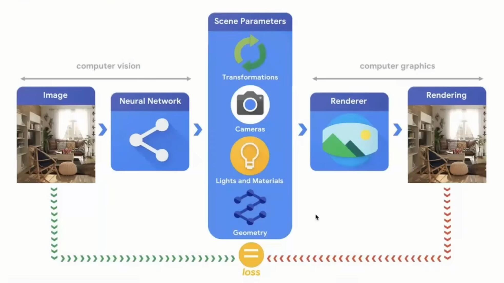
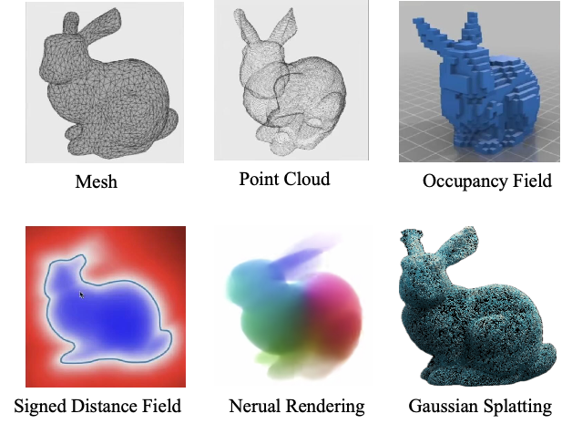
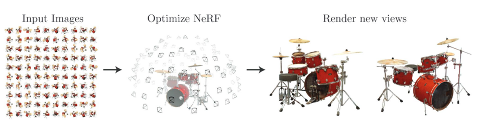
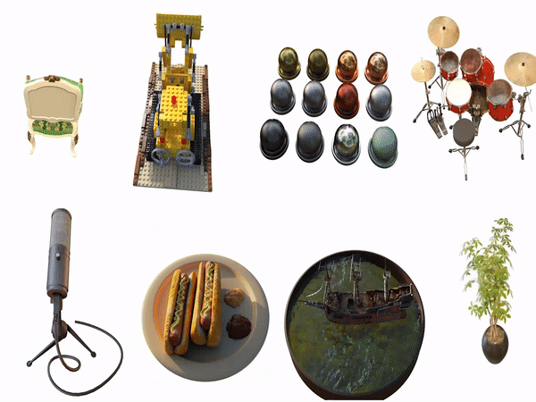
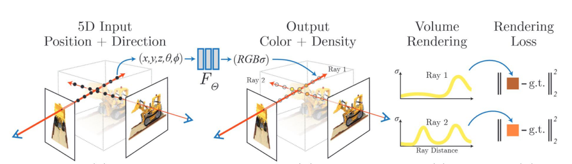
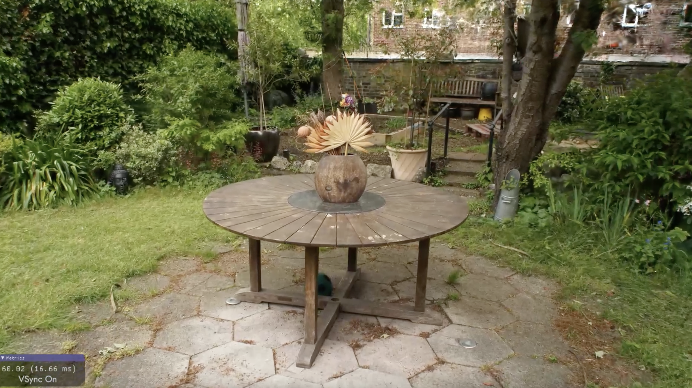
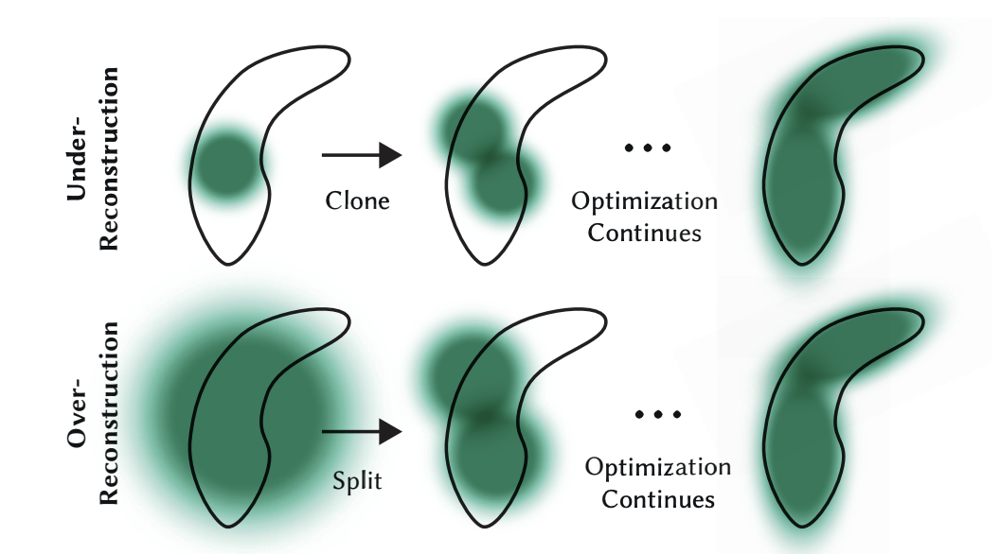

# 第6章 三维生成与编辑

> The ultimate display would, of course, be a room within which the computer could control the existence of matter.（终极显示器理应是一间房间，在那里计算机能掌控物质的存在。）-- Ivan Sutherland

&emsp;&emsp;在短短半个世纪里，三维内容生成与编辑技术从伊万·萨瑟兰（Ivan Sutherland）的“终极显示器”设想，迅速迈向由实时光线追踪、NeRF 及扩散模型驱动的“可触”数字世界；它不仅重塑了影视、游戏与工业设计的生产管线，也改写了我们理解与操控空间信息的方式。如今，算法性能的指数级跃迁与 GPU 并行架构的演进交织，让艺术创意与科学计算进入前所未有的共振期——从单帧渲染到多模态、人机共创的交互编辑，三维技术已成为链接物理与虚拟、数据与叙事的核心枢纽。

## 6.1 三维表征

&emsp;&emsp;世界纷繁复杂，应如何对其进行有效且严谨的表征呢？在计算机图形学领域中，通常将所观察到的场景或物体解耦为两种基本要素，即**外观（appearance）**与**形状（shape/geometry）**。进一步而言，外观可以细分为光照、材质等具体属性。通过将光照、材质与几何结构等元素明确解耦，能够实现对场景或物体的参数化描述，从而为后续的场景建模与编辑提供更为灵活和精准的表达方式。相比之下，计算机视觉领域通常采用一种较为直接的方式，以简单的RGB色彩值对世界进行粗略的表征与理解。这两种不同的表示方式可通过 渲染（rendering）与反渲染（inverse rendering）这对相反过程实现相互转换，从而在抽象的参数空间与具体的图像空间之间建立起严谨而有效的桥梁。很多相关的研究都准从图6.1的理解范式，即真实场景通常是由参数化的形式表征，比如坐标系变换、相机内外参数、光照和材质、物理几何等，然后通过图形学管线的渲染可以得到人类肉眼可见的图片。另一方面计算机视觉做的事情就是利用神经网络来拟合这些图片，得到隐式表征的世界。

图6.1 计算机视觉和计算机图形学如何理解视觉世界

其中，渲染过程依赖于形状与外观的准确表征，并且通常要求该过程是可微的，以支持参数的高效优化和推导。与之相对，反渲染则可粗略理解为基于同一物体或场景多个视角的RGB图像，反推其潜在的几何结构或外观参数的过程。需要指出的是，渲染过程具有确定性，而当前许多反渲染方法本质上则是通过神经网络来近似或推测相关参数，这一推测过程通常是非确定性的，存在一定的不确定性和误差。

那么哪些可以参数化表征场景或者真实世界的形式呢？具体而言，目前参数化表征场景或真实世界的主流方式如图所示。

图6.1 三维表征方式

其中，前三种方式通常被称为**显式表征**（Explicit Representations），它们在实际应用中具备良好的可编辑性，但往往存在资源消耗大、重建困难等缺点；后三种方式则被称为**隐式表征**（Implicit Representations），通常可通过神经网络直接进行重建，具有重建精度高、便于连续表示的优势，但编辑能力相对较弱。其中，后三种隐式表征方式分别利用神经网络预测不同的属性：一种预测物体或场景中每个空间点的符号距离函数；一种预测空间点的密度与可见性；另一种则直接预测三维空间中每个高斯椭球的属性。具体而言，表6.1中进一步详细比较了各种表征方法的核心概念以及各自的优缺点。

| 表征方式 | Mesh                                                       | Point Cloud                                              | Occupancy Field                                          | Signed Distance Field                                              | Nerual Rendering                                                         | Gaussian Splatting                                                                   |
| -------- | ---------------------------------------------------------- | -------------------------------------------------------- | -------------------------------------------------------- | ------------------------------------------------------------------ | ------------------------------------------------------------------------ | ------------------------------------------------------------------------------------ |
| 定义     | 网格是一个点、法向量，面的集合，它定义了一个3D物体的形状。 | 点云用点来描述几何物体。                                 | 三维场景中每个点的状态，1表示点被物体占据，0表示未被占据 | 表面内为负值，在表面外为正值。                                     | 神经辐射场通过神经网络来表示三维场景的颜色和密度。                       | 3D高斯点云渲染技术，通过高斯分布来表示三维场景。可以理解为带有颜色形状等属性的电云。 |
| 优点     | 精确地表示物体的几何形状；易于渲染和编辑。                 | 存储及计算开销较小。                                     | 可表示任意拓扑关系。                                     | 精确地表示物体表面的形状和位置信息。                               | 细节丰富；可以很好地处理复杂的几何形状和光照条件；可以渲染高质量的图像。 | 可以实现实时渲染；可以处理复杂的几何形状和光照条件；可以渲染高质量的图像。           |
| 缺点     | 需要大量的计算资源和储存空间。                             | 不能表示拓扑结构，当点足够多时，才能较好的表示几何特性。 | 高分辨率下非常消耗内存。                                 | 复杂的物体，需要较高的计算资源，因为需要计算出每个点到表面的距离。 | 需要大量的计算资源和数据集来进行训练；难以显式编辑。                     | 虽然渲染速度快质量高，但是难以表示准确的几何形状；难以显式编辑。                     |

接下来，我们着重介绍以下两个表征技术。

### 6.3.1 神经辐射场-NeRF

NeRF（Neural Radiance Field）是一种用多层感知机（MLP）隐式表示 3D 场景的方法。它把场景看作一个连续函数

$$
F_\theta:(x,y,z,\mathbf{d})\;\mapsto\;(\sigma,\mathbf{c})
$$

* **输入**：空间坐标 $(x,y,z)$ 与视线方向 $\mathbf{d}$
* **输出**：体密度 $\sigma$（决定体素对光线的吸收程度）和颜色 $\mathbf{c}$

其过程如图所示，输入物体或者场景100张左右不同视角的2D图像，通过训练NeRF将这个物体或者场景隐式表征起来，然后可以通过它输出任意视角的该物体的2D渲染图像。

图6.3.1 NeRF表征物体或场景流程

通过体渲染积分公式，把这两个输出沿光线积分即可合成任意视角的像素颜色。核心思想是将场景的几何与外观直接编码为RGB辐射场，不再依赖传统图形学的渲染管线。这种隐式表示带来的好处是能够以简洁而高效的方式表征复杂场景；然而，它也因此难以与现有实时渲染管线融合，编辑与交互操作相对受限。渲染结果如图6.3.1所示

图6.3.2 NeRF表征物体的结果

其网络结构也非常简单，如图6.3.3所示。为了得到从某一视角观察时的像素颜色，NeRF采用 **体积渲染（volume rendering）** 技术，即对沿摄像机光线的一系列样本点进行积分估计：对于光线 $r(t) = \mathbf{o} + t\mathbf{d}$，采样多个 $t\_i$ 点，并使用以下近似：

$$
\hat{C}(r) = \sum_{i=1}^N T_i \left(1 - \exp(-\sigma_i \delta_i)\right) \cdot \mathbf{c}_i
$$

其中：$T\_i$ 表示前面样本的透射率，$\sigma\_i$ 表示第 \$i\$ 个样本点的密度，$\delta\_i$ 表示相邻样本点之间的距离，$\mathbf{c}\_i$ 表示第 \$i\$ 个点的颜色。该渲染过程是可微分的，因此可以通过比较预测颜色与真实图像像素颜色之间的误差进行梯度下降训练。

图6.3.3 NeRF网络结构

NeRF 通过学习一个隐式的辐射场函数，以连续方式表示三维场景，实现了从多视角图像中高质量合成新视图的能力。相较于传统的体素网格或点云方法，NeRF 在细节和纹理的表达上具有显著优势，具备高保真度；同时由于其不依赖离散结构，具备良好的场景连续性和表示通用性，适用于任意复杂度的真实场景。然而，NeRF 也面临诸多挑战，例如推理与训练速度较慢、缺乏对几何与外观的可编辑性、以及对精确相机位姿的强依赖，这些因素在实际应用中限制了其灵活性与效率。

### 6.3.2 高斯泼溅-3DGS

3D Gaussian Splatting 是 2023 年 Inria 团队提出的一种**显式**神经渲染方法，可在 1080p 分辨率下实现 ≥ 30 fps 的实时新视角合成，兼顾 NeRF 级别的高质量细节。效果如图6.3.4所示。

图6.3.4 3DGS场景建模渲染效果图

3D Gaussian Splatting 用高斯原语替代 MLP，将隐式体辐射场“显式化”，在不牺牲画质的前提下实现了真正的实时渲染，并为编辑与下游几何处理打开了大门。未来的发展重点将在压缩、动态场景、语义约束与跨模态生成方向。

3DGS 用有限个各向异性三维高斯来近似空间中形状的组成，3DGS 把NeRF中“体渲染的射线积分”换成“屏幕上的各向异性高斯椭圆核叠加”。数学上通过投影的一阶近似雅可比把 3D 协方差变到 2D；通过前到后 α 合成得到可微的颜色；再用多视图监督优化高斯的位置、形状、透明度、视角相关颜色，在质量接近体渲染的同时获得图形学级的实时速度。如图6.3.4所示，在拟合形状的过程中，高斯椭圆的大小形状是在动态变化的。

图6.3.4 3DGS的高斯椭圆拟合空间形状的过程

这种变化可以从数学意义来分析，记第 (i) 个高斯为

$$
\mathcal{G}_i(\mathbf{x})
=\omega_i \mathcal{N}(\mathbf{x};\boldsymbol\mu_i,\boldsymbol\Sigma_i)
=\omega_i(2\pi)^{-3/2}|\boldsymbol\Sigma_i|^{-1/2}
\exp\Big(-\tfrac12(\mathbf{x}-\boldsymbol\mu_i)^\top\boldsymbol\Sigma_i^{-1}(\mathbf{x}-\boldsymbol\mu_i)\Big)
$$

其中 $u_i\in\mathbb{R}^3$ 为3DGS 椭球的中心，$\Sigma_i\in\mathbb{R}^{3\times 3}$ 为对称正定协方差，$\omega_i>0 $ 为密度尺度（或不透明度）。每个高斯同时携带**视角相关颜色**，通常以球谐基（Spherical Harmonics, SH）参数化：

$$
\mathbf{c}_i(\mathbf{v})=\mathbf{M}_i,\mathbf{y}_L(\mathbf{v})
\in\mathbb{R}^3,
$$

$\mathbf{v}$ 是到相机的视向单位向量，$\mathbf{y}_L(\cdot)$ 为到 $L$ 阶的实 SH 基，它的维度为 $B=(L+1)^2$，$\mathbf{M}_i\in\mathbb{R}^{3\times B}$ 为待学参数。直观来说，$\sum_i \mathcal{G}_i$ 近似NeRF的“体密度场”，而 $\mathbf{c}_i(\cdot)$ 近似“方向相关的辐射颜色”。

## 6.2 三维生成

如今借助NeRF、扩散模型与大语言模型驱动的 Text-to-3D 一键生成，3D 内容的创造速度与质量发生很大地跃迁。DreamFusion、Gaussian Splatting 等方法让文本或单张照片即可还原可交互的三维场景；同时，基于 SDF/GAN 的形状潜空间模型，则使海量个性化几何在毫秒级被“召唤”到屏幕。为元宇宙、电商数字孪生、机器人视觉等领域提供了前所未有的内容燃料。
