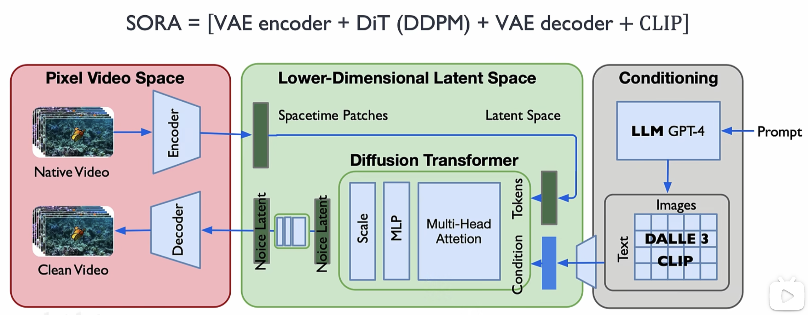
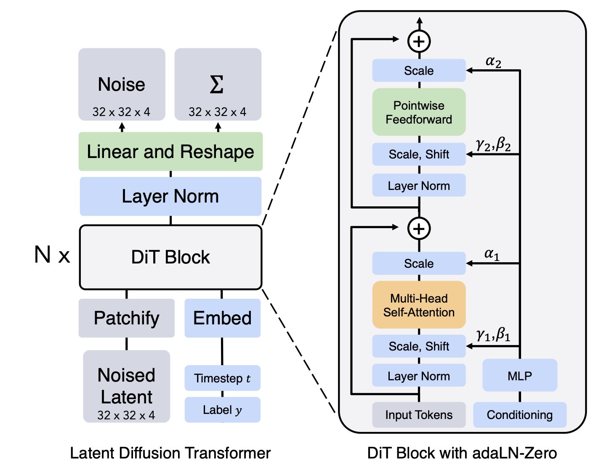

# 第7章 视频生成与编辑

&emsp;&emsp;在过去几年里，图像生成已经做得足够惊艳。但当我们把图像生成拓展到视频生成时，难度突然上升了一个数量级。为什么？因为视频生成不只是让模型画一张图，而是：在保证每一帧都好看的同时，画面“不能乱”、不能闪、物体不能变形，还要让所有动作合乎物理逻辑。也就是说，模型必须理解：

> “物体是什么，具有怎样的结构”
> “物体怎么动，如何符合物理规律”
> “相机如何移动，如何与画面对应”
> “时间是连续的，如何保证连续性”

## 7.1 视频生成

目前的视频生成模型框架（Sora、HunyuanVideo、Pika、Runway 等）普遍被设计为四大模块构成的系统：数据表征（Tokenization）、 生成框架（DiT）、 时空一致性建模 、多模态条件控制。本章中我将借用我在知乎上写的文章 [Sora技术详解及影响分析](https://https://zhuanlan.zhihu.com/p/683004185) 的部分内容来讲述目前视频生成技术的大致生成框架。

图7.1.1 SORA视频生成的原理

### 7.1.1 数据压缩编码

很多人以为视频生成就是“多生成几张图”而已。但实际上，真正的瓶颈来自数据量。一段 5 秒的高分辨率视频（1080p、24fps）包含：1920 × 1080 × 24 × 5 ≈ 2.5 亿像素，如果直接在像素空间上训练扩散模型是不可能的——计算量爆炸，那怎么办？解决方案是将视频压缩成一个“离散语言”。利用 VQ-VAE / VQ-GAN / Mask-VQ等方法（这部分原理可以跳转到 [变分自编码器](https://github.com/datawhalechina/hugging-sd/blob/e079079d40c20d2a87605c2b731afd80f878523e/docs/chapter1.md)），把视频编码为一个token网格。例如 Sora 的 video tokenizer 会先做空间下采样，将像素变成抽象特征，然后通过对时间下采样，即每几帧合成一组时序特征，最后进行向量量化，把连续空间映射到固定字典。最终，一个几百万像素的帧被压缩为几十/几百个token。

为什么视频必须离散化成 token？

1. 离散token很适合transformer（像文本一样处理），
2. 视频压缩比极高，节省计算（比像素空间小数百倍）
3. 离散 latent 有助于稳定视频生成

Tokenization 让视频变成“模型能理解的语言”，让模型终于可以“开口讲话”，甚至讲完整的“故事”。

### 7.1.2 Token生成框架

当视频被 Tokenizer 转成 token 后，接下来最核心的部分是：如何在 token 空间中生成一个视频序列？在视频生成中，通常采用DiT作为主要生成架构，当然也可以用其他生成算法。DiT 是 Sora、HunyuanVideo 的核心架构，也是视频生成的基础设施。 为什么不是 UNet，而是 Transformer？

图7.1.2 DiT主要结构

因为视频是超长序列，几十帧 × 每帧几百个 token ＝ 数千至上万个 token。UNet 可以做图像扩散，但不擅长建模长序列、难以表达复杂的物体关系、在时间维度上不够灵活、扩展到 3D（时空）会特别难训练，而Transformer 则天生适合长序列、具有全局注意力，可以让特征在任意维度自由交流，这就是视频生成所需要的能力。

DiT简单来说就是tansformer+ddpm，核心就是用tansformer的结构替换掉stable diffusion中的unet结构，来预测噪声实现去噪。这个替换可以带来以下优势。

* 随着数据规模或者训练时间的增强，模型表现的效果越好（大力出奇迹的前置条件）
* 实现表明，模型越大，patches越小，效果越好

### 7.1.3 时空一致性建模

如果直接用图像生成方式来生成一帧帧视频，可能会出现：颜色忽深忽浅、物体位置飘移、衣服图案跳变、人脸忽胖忽瘦、背景闪烁、相机运动不连续等问题。因此必须加入专门的视频一致性机制。

- 3D Attention机制。Sora 等模型将 Multi-head Attention 扩展成：空间注意力 + 时间注意力（甚至融合成 joint 3D attention）。作用是将不同帧之间互相“对齐”，并且保证物体、背景、动作的一致性。

- 动作一致性机制。这点特别是在生成有人参与的视频中尤为重要。主要是为了防止物体乱动，模型会显式学习： Motion latents、Optical flow、跨帧关联以及动作轨迹先验。例如：如果前一帧杯子在桌上，下一帧它不应该“突然漂浮起来”。

- 多阶段生成。许多系统（Sora / Pika / Runway）使用多阶段 Refinement：阶段1：生成语义视频（比较模糊）、阶段2：生成纹理/细节、阶段3：生成高清画面、阶段4：帧间一致性修正。这种 coarse-to-fine Pipeline 能大幅提升视频稳定性。

### 7.1.4 多模态条件控制

现代视频生成模型不仅仅是无条件生成一段“随机好看”的视频，它必须能**听懂文本描述、看懂给的图片、跟随指定动作、遵循镜头运动，甚至模仿参考视频风格**。这些能力的背后，本质上都是在做一件事： 把“条件信息”和“视频 token”放到同一个空间里，让它们充分交互。典型的实现手段主要有三类：Cross-Attention、Token 拼接、ControlNet 结构控制。

#### 1. Cross-Attention：让视频“听从”文本/图像/音频的指挥

交叉注意力可以理解为：视频 token 主动去“询问”条件模态应该怎么做**。在实现上，一般把视频 token 作为 Query，把文本/图像/声音的 embedding 作为 Key/Value：“我这一帧应该画什么内容？让我去问问文本和参考图。”

在 **Text-to-Video** 中，文本被编码成一段向量序列，每一层 DiT 在更新视频表示时都会通过 Cross-Attention 读取文本信息，从而决定场景、角色、动作等语义；当文本中出现“镜头缓慢拉近”“突然切换到夜晚”这类描述时，模型也会通过时间位置编码，把这些语义绑定到对应的时间段上。

在 **Image-to-Video** 或“风格参考视频”场景里，参考图像/视频首先被编码为一组特征，再作为 Cross-Attention 的 Key/Value。这样即使用户只给一张静态人像，模型也能在生成的整段视频里尽量保持脸型、发色、服饰的一致性，相当于“用图像做身份与风格约束”。

简而言之，Cross-Attention 是最通用、最核心的条件注入手段：何能变成向量序列的模态，都可以通过它来控制视频。

#### 2. Token 拼接：把条件当成“上下文”，直接写进序列里

Token 拼接的思路更像语言模型：把条件信息直接拼在视频 token 序列前后或中间，让模型把整段当作一个长序列来建模。这样做形式简单，实现上就是把不同模态的 embedding 做线性投影到同一维度，然后在序列维度 concat 即可。并且，自然支持“长视频/多镜头”：你可以把一段故事脚本拆成多个片段，每个片段前面接一小段“剧情说明 token”，模型就能按顺序生成多场景视频，近似一个“多镜头脚本到视频”的过程。与 Cross-Attention 相比，Token 拼接更像是给模型一个“完整上下文”，让它在同一序列上同时学习“说什么”和“怎么画”。

缺点是序列会变得很长，计算成本上升，而且条件与视频之间的耦合更紧，有时不如 Cross-Attention 那样灵活可控。

#### 3. ControlNet（结构控制）：对“骨骼、深度、线稿”进行硬约束

ControlNet 最早在图像扩散领域流行起来，其核心思路是：在主干扩散模型旁边再挂一条“结构控制支路”，把姿态、深度、草图、分割图等结构性条件输入到这条支路中，然后与主干特征融合，从而强约束输出结构。迁移到视频生成时，做法类似，一般会 冻结主干 DiT / U-Net 的权重，只训练 ControlNet 分支，这样不会破坏原有的生成能力，只是在其上叠加“结构服从性”。推理时，主干和 ControlNet 的特征按一定比例融合，形成最终的视频表示。

同时，结构条件本身也必须在时间上连续、平滑，否则模型会被迫在“跳变的条件”与“想维持的时空一致性”之间做艰难取舍，表现为抖动、拉扯感。因此工程上常会对 pose / depth 序列做 temporal smoothing，并且只在关键帧强控制，中间帧弱控制或者插值，为 ControlNet 加时间编码，让它理解运动趋势而不是逐帧独立处理

通过 ControlNet，用户可以做到非常精确的控制：比如“让角色严格按照给定舞蹈骨骼跳舞，但衣服材质、背景风格仍由主干模型自由发挥”，实现结构刚性 + 视觉多样性的平衡。

# 7.2 视频编辑
